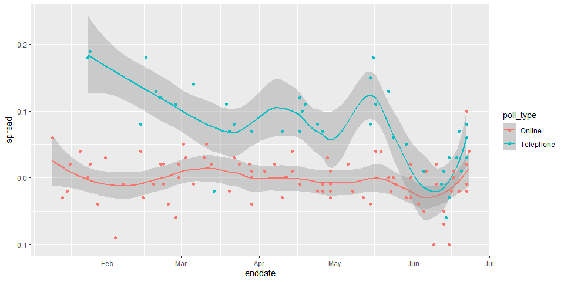

Brexit Poll Analysis
================

# Overview

In June 2016, the United Kingdom (UK) held a referendum to determine
whether the country would “Remain” in the European Union (EU) or “Leave”
the EU. This referendum is commonly known as Brexit. Although the media
and others interpreted poll results as forecasting “Remain” ( 𝑝&gt;0.5)
, the actual proportion that voted “Remain” was only 48.1% (𝑝=0.481) and
the UK thus voted to leave the EU. Pollsters in the UK were criticized
for overestimating support for “Remain”. In this project, we will
analyze real Brexit polling data to develop polling models to forecast
Brexit results.

``` r
library(tidyverse)
```

    ## -- Attaching packages --------------------------------------- tidyverse 1.3.1 --

    ## v ggplot2 3.3.3     v purrr   0.3.4
    ## v tibble  3.1.1     v dplyr   1.0.6
    ## v tidyr   1.1.3     v stringr 1.4.0
    ## v readr   1.4.0     v forcats 0.5.1

    ## -- Conflicts ------------------------------------------ tidyverse_conflicts() --
    ## x dplyr::filter() masks stats::filter()
    ## x dplyr::lag()    masks stats::lag()

``` r
library(dslabs)
data(brexit_polls)
options(digits = 3)
```

Define p=0.481 as the actual percent voting for “Remain”. The spread
being 2p-1.

``` r
p <- 0.481
d <- 2*p - 1
```

Considering a poll of 1500 voters, the real values of sample parameters
are:-

``` r
N <- 1500
expected <- N*p #expected total number of voters in the sample choosing “Remain”
expected
```

    ## [1] 722

``` r
se_remain <- sqrt(N*p*(1-p)) #standard error of the total number of voters in the sample choosing “Remain”
se_remain
```

    ## [1] 19.4

``` r
x_hat <- p #expected value of X_hat , the proportion of “Remain” voters
x_hat
```

    ## [1] 0.481

``` r
standard_error_x_hat <- sqrt(x_hat * (1-x_hat)/N)
se_d <- 2 * standard_error_x_hat
```

### Actual Brexit poll estimates

Load and inspect the brexit\_polls dataset from dslabs, which contains
actual polling data for the 6 months before the Brexit vote. Raw
proportions of voters preferring “Remain”, “Leave”, and “Undecided” are
available (remain, leave, undecided) The spread is also available
(spread), which is the difference in the raw proportion of voters
choosing “Remain” and the raw proportion choosing “Leave”.

``` r
head(brexit_polls)
```

    ##    startdate    enddate   pollster poll_type samplesize remain leave undecided
    ## 1 2016-06-23 2016-06-23     YouGov    Online       4772   0.52  0.48      0.00
    ## 2 2016-06-22 2016-06-22    Populus    Online       4700   0.55  0.45      0.00
    ## 3 2016-06-20 2016-06-22     YouGov    Online       3766   0.51  0.49      0.00
    ## 4 2016-06-20 2016-06-22 Ipsos MORI Telephone       1592   0.49  0.46      0.01
    ## 5 2016-06-20 2016-06-22    Opinium    Online       3011   0.44  0.45      0.09
    ## 6 2016-06-17 2016-06-22     ComRes Telephone       1032   0.54  0.46      0.00
    ##   spread
    ## 1   0.04
    ## 2   0.10
    ## 3   0.02
    ## 4   0.03
    ## 5  -0.01
    ## 6   0.08

The average and standard deviation of the observed spreads is given by

``` r
polls <- brexit_polls %>%
  mutate(x_hat = (spread+1)/2)
mean(polls$spread)
```

    ## [1] 0.0201

``` r
sd(polls$spread)
```

    ## [1] 0.0588

The average and standard deviation of x\_hat

``` r
mean(polls$x_hat)
```

    ## [1] 0.51

``` r
sd(polls$x_hat)
```

    ## [1] 0.0294

### Confidence interval of a Brexit poll

Consider the first poll in brexit\_polls, a YouGov poll run on the same
day as the Brexit referendum:

``` r
you_gov <- polls[1, ]
```

We compute the 95% confidence interval for the poll.

``` r
avg <- you_gov$x_hat
N <- you_gov$samplesize

se <- sqrt(avg*(1-avg)/N)
avg + c(-1,1) * qnorm(0.975)*se
```

    ## [1] 0.506 0.534

We see that the poll is 95% confident that the result will be in the
range (0.506, 0.534) that is “Remain”.

### Confidence intervals for polls in June

Create the data frame june\_polls containing only Brexit polls ending in
June 2016 (enddate of “2016-06-01” and later). We will calculate
confidence intervals for all polls and determine how many cover the true
value of d.

First, use mutate() to calculate a plug-in estimate se\_x\_hat for the
standard error of the estimate SE for each poll given its sample size
and value of X\_hat. Second, we use mutate() to calculate an estimate
for the standard error of the spread for each poll given the value of
se\_x\_hat. Then, we use mutate() to calculate upper and lower bounds
for 95% confidence intervals of the spread. Last, add a column hit that
indicates whether the confidence interval for each poll covers the
correct spread 𝑑=−0.038.

``` r
june_polls <- polls %>%
  filter(enddate>="2016-06-1")
head(june_polls)
```

    ##    startdate    enddate   pollster poll_type samplesize remain leave undecided
    ## 1 2016-06-23 2016-06-23     YouGov    Online       4772   0.52  0.48      0.00
    ## 2 2016-06-22 2016-06-22    Populus    Online       4700   0.55  0.45      0.00
    ## 3 2016-06-20 2016-06-22     YouGov    Online       3766   0.51  0.49      0.00
    ## 4 2016-06-20 2016-06-22 Ipsos MORI Telephone       1592   0.49  0.46      0.01
    ## 5 2016-06-20 2016-06-22    Opinium    Online       3011   0.44  0.45      0.09
    ## 6 2016-06-17 2016-06-22     ComRes Telephone       1032   0.54  0.46      0.00
    ##   spread x_hat
    ## 1   0.04 0.520
    ## 2   0.10 0.550
    ## 3   0.02 0.510
    ## 4   0.03 0.515
    ## 5  -0.01 0.495
    ## 6   0.08 0.540

``` r
d <- -0.38
june_polls <- june_polls %>%
  mutate(se_x_hat = sqrt(x_hat * (1-x_hat)/ samplesize), se_spread = 2*se_x_hat,
         lower = spread - qnorm(0.975) * se_spread,
         upper = spread + qnorm(0.975) * se_spread,
         hit = (lower < 2*p-1 & upper > 2*p-1))
mean(june_polls$lower < 0 & june_polls$upper > 0) #proportion of polls that had a 0 in their prediction
```

    ## [1] 0.625

``` r
mean(june_polls$hit) #avg hitrate
```

    ## [1] 0.562

``` r
head(june_polls)
```

    ##    startdate    enddate   pollster poll_type samplesize remain leave undecided
    ## 1 2016-06-23 2016-06-23     YouGov    Online       4772   0.52  0.48      0.00
    ## 2 2016-06-22 2016-06-22    Populus    Online       4700   0.55  0.45      0.00
    ## 3 2016-06-20 2016-06-22     YouGov    Online       3766   0.51  0.49      0.00
    ## 4 2016-06-20 2016-06-22 Ipsos MORI Telephone       1592   0.49  0.46      0.01
    ## 5 2016-06-20 2016-06-22    Opinium    Online       3011   0.44  0.45      0.09
    ## 6 2016-06-17 2016-06-22     ComRes Telephone       1032   0.54  0.46      0.00
    ##   spread x_hat se_x_hat se_spread   lower  upper   hit
    ## 1   0.04 0.520  0.00723    0.0145  0.0117 0.0683 FALSE
    ## 2   0.10 0.550  0.00726    0.0145  0.0716 0.1284 FALSE
    ## 3   0.02 0.510  0.00815    0.0163 -0.0119 0.0519 FALSE
    ## 4   0.03 0.515  0.01253    0.0251 -0.0191 0.0791 FALSE
    ## 5  -0.01 0.495  0.00911    0.0182 -0.0457 0.0257  TRUE
    ## 6   0.08 0.540  0.01551    0.0310  0.0192 0.1408 FALSE

### Hit rate by pollster

To find the proportion of hits for each pollster and the number of polls
per pollster.

``` r
june_polls_grouped <- june_polls %>%
  group_by(pollster) %>%
  summarize(n_polls = n(), hits = sum(hit))
june_polls_grouped
```

    ## # A tibble: 12 x 3
    ##    pollster           n_polls  hits
    ##    <fct>                <int> <int>
    ##  1 BMG Research             2     0
    ##  2 ComRes                   3     1
    ##  3 ICM                      3     3
    ##  4 Ipsos MORI               2     1
    ##  5 Opinium                  3     2
    ##  6 ORB                      3     2
    ##  7 ORB/Telegraph            1     0
    ##  8 Populus                  1     0
    ##  9 Survation                2     1
    ## 10 Survation/IG Group       1     1
    ## 11 TNS                      2     2
    ## 12 YouGov                   9     5

### Boxplot of Brexit polls by poll type

``` r
ggplot(june_polls, aes(poll_type, spread))+
  geom_boxplot()+
  geom_point()
```


### Combined spread across poll type

We Calculate the confidence intervals of the spread combined across all
polls in june\_polls, grouping by poll type. To determine the standard
error of the spread, we will need to double the standard error of the
estimate.

``` r
combined_by_type <- june_polls %>%
        group_by(poll_type) %>%
        summarize(N = sum(samplesize),
                  spread = sum(spread*samplesize)/N,
                  p_hat = (spread + 1)/2,
                  se_spread = 2 * sqrt(p_hat*(1-p_hat)/N),
                  lower = spread - qnorm(0.975) * se_spread,
                  upper = spread + qnorm(0.975) * se_spread)
combined_by_type
```

    ## # A tibble: 2 x 7
    ##   poll_type     N   spread p_hat se_spread    lower   upper
    ##   <fct>     <dbl>    <dbl> <dbl>     <dbl>    <dbl>   <dbl>
    ## 1 Online    46711 -0.00741 0.496   0.00463 -0.0165  0.00165
    ## 2 Telephone 13490  0.0127  0.506   0.00861 -0.00414 0.0296

### Chi-squared p-value test

The following code computes the confidence intervals for all Brexit
polls in 2016 and then calculates whether the confidence interval covers
the actual value of the spread 𝑑=−0.038 :

``` r
brexit_hit <- brexit_polls %>%
  mutate(p_hat = (spread + 1)/2,
         se_spread = 2*sqrt(p_hat*(1-p_hat)/samplesize),
         spread_lower = spread - qnorm(.975)*se_spread,
         spread_upper = spread + qnorm(.975)*se_spread,
         hit = spread_lower < -0.038 & spread_upper > -0.038) %>%
  select(poll_type, hit)
```

We use brexit\_hit to make a two-by-two table of poll type and hit
status. Then use the chisq.test() function to perform a chi-squared test
to determine whether the difference in hit rate is significant.

What is the p-value of the chi-squared test comparing the hit rate of
online and telephone polls?

``` r
totals <- brexit_hit%>%
  summarize(online_yes=sum(poll_type=="Online" & hit==TRUE),
            online_no=sum(poll_type=="Online" & hit==FALSE),
            tele_yes=sum(hit==TRUE & poll_type=='Telephone'),
            tele_no=sum(hit == FALSE & poll_type == 'Telephone'))
totals
```

    ##   online_yes online_no tele_yes tele_no
    ## 1         48        37       10      32

``` r
two_by_two <- tibble(hit = c('yes','no'),
                     online = c(totals$online_yes, totals$online_no),
                     telephone = c(totals$tele_yes, totals$tele_no))
two_by_two
```

    ## # A tibble: 2 x 3
    ##   hit   online telephone
    ##   <chr>  <int>     <int>
    ## 1 yes       48        10
    ## 2 no        37        32

``` r
chisq_test <- two_by_two %>% select(-hit) %>% chisq.test()
chisq_test
```

    ## 
    ##  Pearson's Chi-squared test with Yates' continuity correction
    ## 
    ## data:  .
    ## X-squared = 11, df = 1, p-value = 0.001

``` r
online_yes_odds <- (two_by_two$online[1] / sum(two_by_two$online)) / (two_by_two$online[2] / sum(two_by_two$online))
online_yes_odds
```

    ## [1] 1.3

``` r
telephone_yes_odds <- (two_by_two$telephone[1] / sum(two_by_two$telephone)) / (two_by_two$telephone[2] / sum(two_by_two$telephone))
telephone_yes_odds
```

    ## [1] 0.312

``` r
online_yes_odds / telephone_yes_odds
```

    ## [1] 4.15

The odds are for online polls to hit versus telephone polls are 4.15
larger.

### Plotting spread over time

``` r
brexit_polls %>%
  ggplot(aes(enddate, spread, color=poll_type))+
  geom_smooth(method = "loess", span=0.4)+
  geom_point(aes(color=poll_type))+
  geom_hline(yintercept = -0.038)
```

    ## `geom_smooth()` using formula 'y ~ x'



### Plotting raw percentages over time

``` r
brexit_long <- brexit_polls %>%
    gather(vote, proportion, "remain":"undecided") %>%
    mutate(vote = factor(vote))
head(brexit_long)
```

    ##    startdate    enddate   pollster poll_type samplesize spread   vote
    ## 1 2016-06-23 2016-06-23     YouGov    Online       4772   0.04 remain
    ## 2 2016-06-22 2016-06-22    Populus    Online       4700   0.10 remain
    ## 3 2016-06-20 2016-06-22     YouGov    Online       3766   0.02 remain
    ## 4 2016-06-20 2016-06-22 Ipsos MORI Telephone       1592   0.03 remain
    ## 5 2016-06-20 2016-06-22    Opinium    Online       3011  -0.01 remain
    ## 6 2016-06-17 2016-06-22     ComRes Telephone       1032   0.08 remain
    ##   proportion
    ## 1       0.52
    ## 2       0.55
    ## 3       0.51
    ## 4       0.49
    ## 5       0.44
    ## 6       0.54

``` r
brexit_long %>%
  ggplot(aes(enddate, proportion, color=vote))+
           geom_smooth(method = "loess", span=0.3)
```

    ## `geom_smooth()` using formula 'y ~ x'


